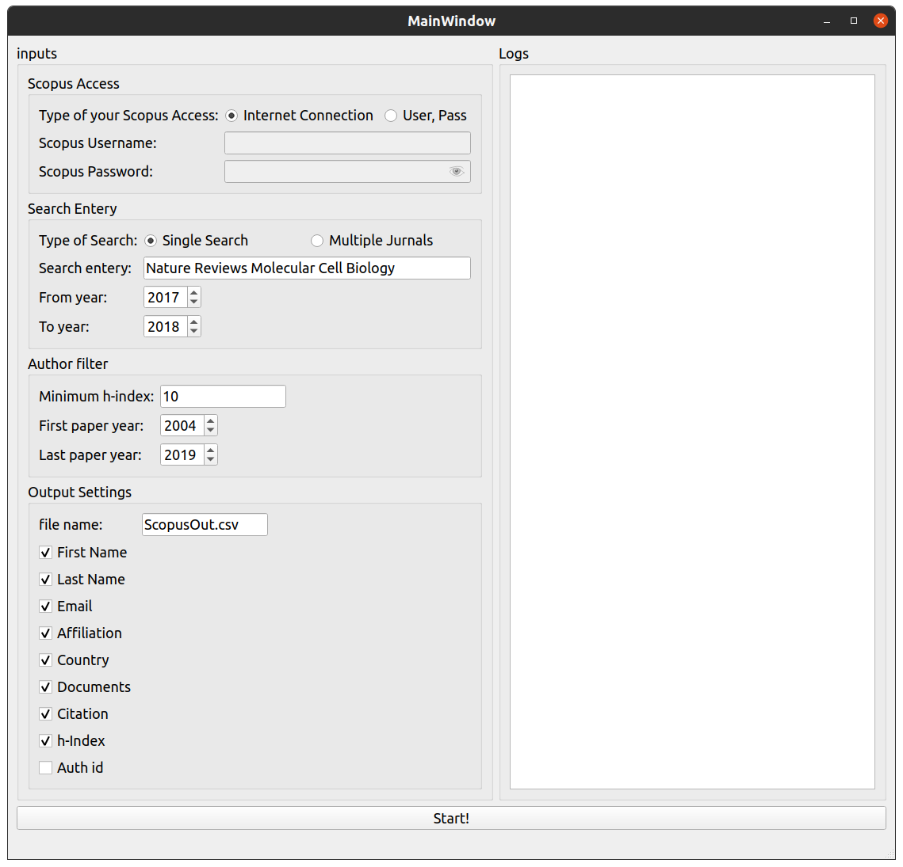

<div align="center" id="top"> 
  

  &#xa0;

  <!-- <a href="https://python.netlify.app">Demo</a> -->
</div>

<h1 align="center">Scopus-Authors</h1>

<p align="center">
  

  

  

  

  <!--  -->

  <!--  -->

  <!--  -->
</p>

<!-- Status -->

<!-- <h4 align="center"> 
	🚧  Scopus-Authors 🚀 Under construction...  🚧
</h4> 

<hr> -->

<p align="center">
  <a href="#about">About</a> &#xa0; | &#xa0; 
  <a href="#features">Features</a> &#xa0; | &#xa0;
  <a href="#requirements">Requirements</a> &#xa0; | &#xa0;
  <a href="#starting">Starting</a> &#xa0; | &#xa0;
  <a href="#license">License</a> &#xa0; | &#xa0;
  <a href="https://github.com/fsunroo" target="_blank">Author</a>
</p>

<br>

## About ##


this app was inintially written for USERN
you can search scopus dataset using multi filters and search entery, after filtering your desiered authurs age this app will return you a list of authurs including theire email and other affilliation data.
## Features ##

* using custom filters and search enteries
* csv output
* including email output
* simple GUI


## Requirements ##

Before starting :checkered_flag:, you need to have 
* js2py
* requests
* mechanize
* pyqt5
installed, you can do this with ``` $pip install -r requirements.txt```


## Starting ##

```bash
# Clone this project
$ git clone https://github.com/fsunroo/Scopus-Authors

# Access
$ cd Scopus-Authors

# Install requirements
$ pip install -r requirements.txt

# Run the project
$ pythhon uiscopus.py

```

## License ##

This project is under license from GPL. For more details, see the [LICENSE](LICENSE) file.


Made with :heart: by <a href="https://github.com/fsunroo" target="_blank">Mohammad Farhadi</a>

&#xa0;

<a href="#top">Back to top</a>
